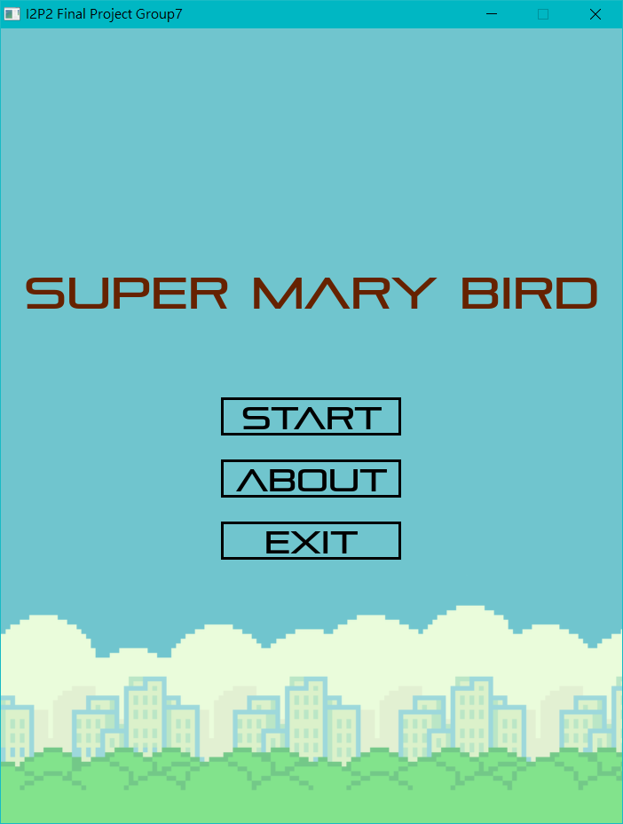

# FlappyBird

Flappy Bird game written in C++ programming language and object-oriented programming way, leveraging the power of the [Allegro 5](https://github.com/liballeg/allegro5) library.

## Run

1. Install [Code::Blocks](https://www.codeblocks.org/)
2. Open the [Code::Blocks](https://www.codeblocks.org/) project file `FlappyBird/FlappyBird.cbp`
3. Build and run the project

## Screenshots

|  |  |
| --- | --- |
